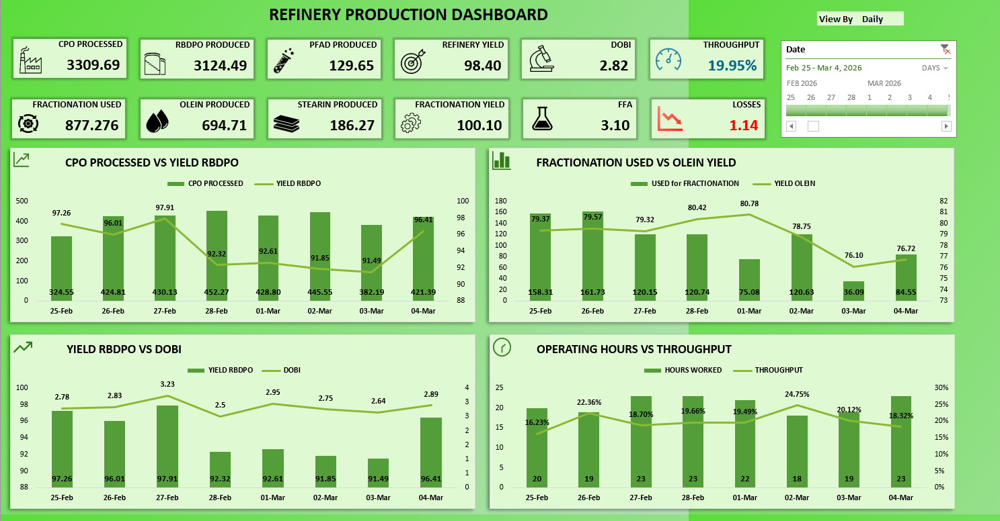

# Refinery Production Dashboard

**Company:** Presco Plc
**Category:** Production Analytics · Real-Time Monitoring & Reporting
**Tools:** Microsoft Excel (live-connected), company production server
**Status:** Deployed — in active use for daily and management reporting

---

## Overview

A real-time production dashboard built in Excel for Presco's palm oil refinery, connected directly to the plant's production server. It replaced a process where no consistent production report existed at all — weekly, monthly, and quarterly reports that used to take hours to assemble by hand now take seconds: open the workbook, click refresh, and every figure updates from the live server. It gives management, executives, floor supervisors, and the QC team a single live view of processing volumes, yields, throughput, and quality (including DOBI) for daily calls and management reporting.

## Dashboard Snapshot

12 live KPI cards across the top of the dashboard, filterable by date range and by Daily/Weekly/Monthly/Quarterly view:

| KPI | Sample value (8-day window) |
|---|---|
| CPO Processed | 3,309.69 tons |
| RBDPO Produced | 3,124.49 tons |
| PFAD Produced | 129.65 tons |
| Refinery Yield | 98.40% |
| DOBI (quality) | 2.82 |
| Throughput (CPO processed relative to hours worked) | 19.95% |
| Fractionation Used | 877.28 tons |
| Olein Produced | 694.71 tons |
| Stearin Produced | 186.27 tons |
| Fractionation Yield | 100.10% |
| FFA | 3.10% |
| Losses | 1.14% |

Below the KPI cards, four trend charts break these down by day: CPO Processed vs. Yield RBDPO, Fractionation Used vs. Olein Yield, Yield RBDPO vs. DOBI, and Operating Hours vs. Throughput — each pairing a volume metric against its corresponding efficiency/quality metric so a viewer can see not just *how much* was processed but *how well*.

In the sample week shown, daily CPO processed ran 324.55–452.27 tons against 18–23 operating hours/day — an actual throughput of roughly 15–22 tons of CPO per hour, which is what the dashboard's own Throughput % card is built to track over time.

## The Business Problem

| Before | Impact |
|---|---|
| No consistent production report existed | Every stakeholder — management, floor, QC — worked from whatever data they could individually track down |
| Downtime figures lived in paper lab reports | Anyone who needed a downtime number had to physically pull and read paper records — slow, and easy to get wrong or out of date |
| No single real-time view of the refinery | Throughput, yield, and quality decisions were made without a current, trustworthy picture of the plant |
| No easy way to compare performance across time periods | Daily/management reporting was slow to assemble and hard to compare period-over-period |

## The Solution

Connected Excel directly to the refinery's production server as a live data source — the same server where operators enter production and downtime figures — then built a dashboard on top of it to:

- Pull throughput, downtime, yield, and quality data automatically, straight from the server, removing the paper-report lookup entirely
- Visualize plant-wide KPIs — throughput/output volume, downtime/uptime, yield/efficiency, and quality (including DOBI on CPO processed) — in one place
- Refresh in real time, so the numbers on screen reflect the current state of the plant rather than the last paper entry
- Break performance down across different time frames (e.g., shift, daily, weekly) for trend and comparison views

## Data & Tools

| Component | Detail |
|---|---|
| Data source | Refinery production server (direct connection) — the same system where operators log production and downtime data |
| Plant scale | Palm oil refinery, plant-wide; actual throughput runs roughly 15–22 tons of CPO/hour depending on operating hours |
| Refresh | Real-time / live — one-click refresh pulls current server data into the workbook |
| Build tool | Microsoft Excel |
| Output | 12-KPI dashboard (CPO/RBDPO/PFAD/Olein/Stearin volumes, refinery & fractionation yield, throughput, DOBI, FFA, losses) with 4 trend charts and Daily/Weekly/Monthly/Quarterly views |

## Results & Business Impact

| Metric | Result |
|---|---|
| Data access | Downtime and production figures that used to require pulling a paper lab report are now live on screen — connected directly to the server where they're entered |
| Adoption | Used daily across four functions: plant/production management, executives, floor supervisors, and the QC team |
| Decision-making | Daily production decisions now backed by live throughput, downtime, yield, and quality data instead of paper records |
| Reporting speed | Weekly, monthly, and quarterly reports that used to take **hours** to assemble by hand now take **seconds or less** — open the workbook, click refresh, and all data updates automatically from the live server |
| Analysis depth | Performance now viewable across multiple time frames to support both shift-level and longer-horizon decisions |

## Skills Demonstrated

`Excel` · `Live server data connections` · `Production KPI design` · `Throughput & downtime analysis` · `Quality metrics (DOBI)` · `Dashboard design` · `Executive reporting`

## Dashboard Screenshot

