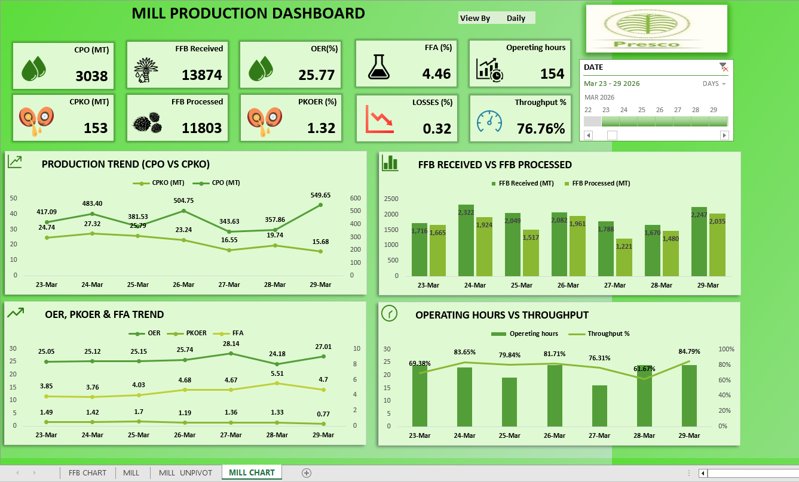

# Mill Production Dashboard

**Company:** Presco Plc
**Category:** Production Analytics · Real-Time Monitoring & Reporting
**Tools:** Microsoft Excel (live-connected), company production server
**Status:** Deployed — in active use for daily and management reporting

---

## Overview

A real-time production dashboard built in Excel for Presco's palm mill, tracking the journey from raw Fresh Fruit Bunches (FFB) through to extracted CPO (Crude Palm Oil) and CPKO (Crude Palm Kernel Oil). Like the Refinery dashboard, it replaced a process where no consistent production report existed — weekly, monthly, and quarterly reports that used to take hours to assemble by hand now take seconds: open the workbook, click refresh, and every figure updates from the live server. It gives management, executives, floor supervisors, and the QC team a single live view of intake, extraction efficiency, and losses.

## Dashboard Snapshot

10 live KPI cards across the top of the dashboard, filterable by date range and by Daily/Weekly/Monthly/Quarterly view:

| KPI | Sample value (7-day window, Mar 23–29) |
|---|---|
| CPO | 3,038 MT |
| CPKO | 153 MT |
| FFB Received | 13,874 MT |
| FFB Processed | 11,803 MT |
| OER (Oil Extraction Rate) | 25.77% |
| PKOER (Palm Kernel Oil Extraction Rate) | 1.32% |
| FFA (Free Fatty Acid) | 4.46% |
| Losses | 0.32% |
| Operating hours | 154 hrs (~22 hrs/day avg) |
| Throughput | 76.76% |

Below the KPI cards, four trend charts break these down by day: Production Trend (CPO vs. CPKO), FFB Received vs. FFB Processed, OER/PKOER/FFA Trend, and Operating Hours vs. Throughput — the same "volume next to its efficiency/quality counterpart" pattern as the Refinery dashboard, so a viewer can see intake, extraction rate, and quality together rather than as disconnected numbers.

In the sample week, daily FFB received ran 1,670–2,322 MT against daily FFB processed of 1,221–2,035 MT — meaning processed volume trailed intake most days, which is exactly the kind of backlog/capacity gap this dashboard surfaces immediately instead of hiding it in separate paper logs. Daily throughput swung from 61.67% to 84.79%, a range that would be invisible without a day-by-day live view.

## The Business Problem

| Before | Impact |
|---|---|
| No consistent production report existed | Management, floor supervisors, and QC each worked from whatever data they could individually track down |
| FFB intake, extraction rates, and losses tracked manually / on paper | Slow to assemble, easy to get wrong or out of date, no easy way to spot a gap between FFB received and FFB actually processed |
| No single real-time view of the mill | Extraction efficiency (OER/PKOER) and quality (FFA) decisions were made without a current, trustworthy picture of the plant |
| No easy way to compare performance across time periods | Daily/management reporting was slow to assemble and hard to compare period-over-period |

## The Solution

Connected Excel directly to the mill's production server as a live data source — the same server where operators log FFB intake, processing, and extraction figures — then built a dashboard on top of it to:

- Pull FFB intake/processed volumes, extraction rates, and quality data automatically, straight from the server, removing the manual/paper lookup entirely
- Visualize plant-wide KPIs — CPO/CPKO output, OER/PKOER extraction efficiency, FFA quality, losses, and throughput — in one place
- Refresh in real time, so the numbers on screen reflect the current state of the mill rather than a stale manual entry
- Break performance down across different time frames (e.g., daily, weekly, monthly, quarterly) for trend and comparison views

## Data & Tools

| Component | Detail |
|---|---|
| Data source | Mill production server (direct connection) — the same system where operators log FFB intake and processing data |
| Plant scale | Palm mill, plant-wide; processed 11,803 MT of FFB against 13,874 MT received over the 7-day sample window |
| Refresh | Real-time / live — one-click refresh pulls current server data into the workbook |
| Build tool | Microsoft Excel |
| Output | 10-KPI dashboard (CPO/CPKO output, FFB received/processed, OER/PKOER, FFA, losses, throughput) with 4 trend charts and Daily/Weekly/Monthly/Quarterly views |

## Results & Business Impact

| Metric | Result |
|---|---|
| Data access | FFB intake, extraction, and quality figures that used to be tracked manually are now live on screen — connected directly to the server where they're entered |
| Adoption | Used daily across four functions: plant/production management, executives, floor supervisors, and the QC team |
| Decision-making | Daily milling decisions now backed by live FFB intake, extraction rate (OER/PKOER), and quality (FFA) data instead of manual records |
| Reporting speed | Weekly, monthly, and quarterly reports that used to take **hours** to assemble by hand now take **seconds or less** — open the workbook, click refresh, and all data updates automatically from the live server |
| Visibility into backlog | FFB received vs. FFB processed is now visible side by side, surfacing intake/capacity gaps (as seen in the sample week) that used to be buried across separate logs |

## Skills Demonstrated

`Excel` · `Live server data connections` · `Production KPI design` · `Extraction rate analysis (OER/PKOER)` · `Quality metrics (FFA)` · `Dashboard design` · `Executive reporting`

## Dashboard Screenshot

