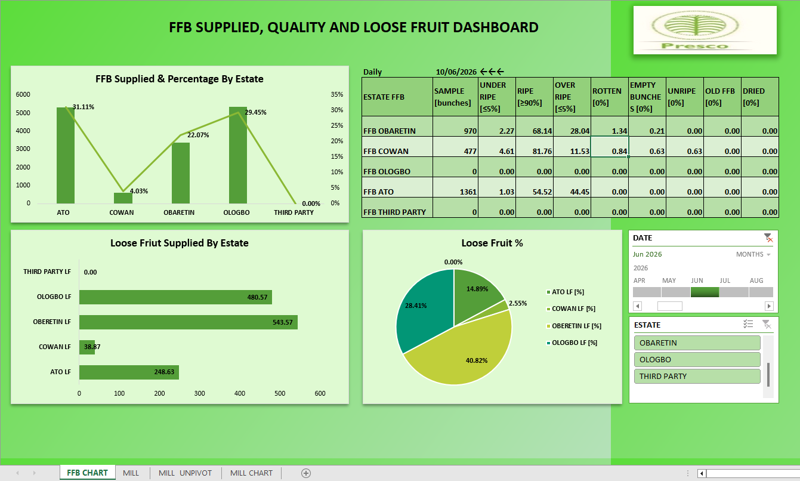

# FFB Supply Chain & Quality Dashboard

**Company:** Presco Plc
**Category:** Supply Chain Analytics · Quality Control · Real-Time Monitoring
**Tools:** Microsoft Excel (live-connected), company production server
**Status:** Deployed — in active use for daily and management reporting

---

## Overview

A real-time dashboard tracking Fresh Fruit Bunch (FFB) supply and quality across Presco's estates — Obaretin, Cowan, Ologbo, and Ato — plus third-party suppliers, before that fruit reaches the mill. Like the Refinery and Mill dashboards, it replaced a process where no consistent report existed: FFB intake volume, ripeness grading, and loose fruit were tracked manually. Now management, executives, floor supervisors, and the QC team see, per estate, per day, exactly how much fruit came in and whether it met quality standard — not after the fact, but immediately.

## Dashboard Snapshot

**FFB quality grading table** — each estate's daily sample is graded against fixed quality standards (shown in brackets), so a deviation is visible at a glance rather than buried in a paper log:

| Estate | Sample (bunches) | Under Ripe (std ≤5%) | Ripe (std ≥90%) | Over Ripe (std ≤5%) | Rotten (std 0%) | Empty Bunches (std 0%) |
|---|---|---|---|---|---|---|
| Obaretin | 970 | 2.27% | 68.14% | 28.04% | 1.34% | 0.21% |
| Cowan | 477 | 4.61% | 81.76% | 11.53% | 0.84% | 0.63% |
| Ato | 1,361 | 1.03% | 54.52% | 44.45% | 0.00% | 0.00% |
| Ologbo | 0 (no supply that day) | – | – | – | – | – |
| Third Party | 0 (no supply that day) | – | – | – | – | – |

**FFB Supplied & Percentage by Estate** (share of total daily intake): Ato 31.11%, Ologbo 29.45%, Obaretin 22.07%, Cowan 4.03%, Third Party 0.00%

**Loose Fruit Supplied by Estate** (tons): Obaretin 543.57, Ologbo 480.57, Ato 248.63, Cowan 38.87, Third Party 0.00 — visualized both as absolute tons and as a % breakdown (Obaretin 40.82%, Ologbo 28.41%, Ato 14.89%, Cowan 2.55%)

Filterable by Daily/Monthly view, by date, and by estate.

**What the dashboard exposes immediately:** on the sampled day, not one of the three active estates hit the ≥90% Ripe standard — and Over Ripe ran far above the ≤5% standard at both Obaretin (28.04%) and especially Ato (44.45%, nearly 9x the standard). Under a manual, paper-based process, a gap like that could go unnoticed for days. Here it's visible the same day it happens.

## The Business Problem

| Before | Impact |
|---|---|
| No consistent report on FFB supply/quality existed | Management, floor supervisors, and QC each worked from whatever data they could individually track down |
| FFB intake and ripeness grading tracked manually | Slow to assemble, easy to get wrong or out of date, and quality deviations (over-ripe, rotten fruit) could go unnoticed for days |
| No per-estate visibility | No easy way to see which estate was supplying under-standard fruit, or how much loose fruit each estate contributed |
| No easy way to compare performance across time periods | Daily/management reporting was slow to assemble and hard to compare period-over-period |

## The Solution

Connected Excel directly to the production server as a live data source — the same system where FFB intake and quality samples are logged — then built a dashboard on top of it to:

- Pull FFB intake volume, ripeness grading, and loose fruit data automatically per estate, removing the manual/paper lookup entirely
- Grade each estate's daily sample against fixed quality standards (Ripe ≥90%, Under/Over Ripe ≤5%, Rotten/Empty Bunches/Unripe/Old FFB/Dried at 0%) so deviations are visible immediately, not discovered later
- Visualize FFB supplied and loose fruit both as absolute volume and as % share by estate, so supply concentration and quality issues are visible side by side
- Refresh in real time and filter by Daily/Monthly view, date, and estate

## Data & Tools

| Component | Detail |
|---|---|
| Data source | Production server (direct connection) — the same system where FFB intake and quality samples are logged |
| Scope | 4 Presco estates (Obaretin, Cowan, Ologbo, Ato) plus third-party suppliers |
| Refresh | Real-time / live — one-click refresh pulls current server data into the workbook |
| Build tool | Microsoft Excel (same workbook suite as the Mill dashboard) |
| Output | FFB quality grading table (9 grading categories per estate vs. fixed standards), FFB-supplied-by-estate chart, loose fruit volume and % breakdown by estate, Daily/Monthly filtering |

## Results & Business Impact

| Metric | Result |
|---|---|
| Data access | FFB supply and quality figures that used to be tracked manually are now live on screen — connected directly to the server where they're logged |
| Adoption | Used daily across four functions: plant/production management, executives, floor supervisors, and the QC team |
| Quality visibility | Ripeness grading against fixed standards is visible per estate per day — e.g. an Over Ripe rate running 6–9x the ≤5% standard is now flagged immediately instead of discovered later |
| Supply visibility | Each estate's share of total FFB and loose fruit supply is visible at a glance, surfacing supply concentration (e.g. two estates — Ato and Ologbo — together supplying over 60% of daily FFB) |
| Reporting speed | Daily and management reports assembled from one live source instead of by hand from scattered manual records |

## Skills Demonstrated

`Excel` · `Live server data connections` · `Supply chain analytics` · `Quality grading against fixed standards` · `Multi-source/multi-estate reporting` · `Dashboard design` · `Executive reporting`

## Dashboard Screenshot

