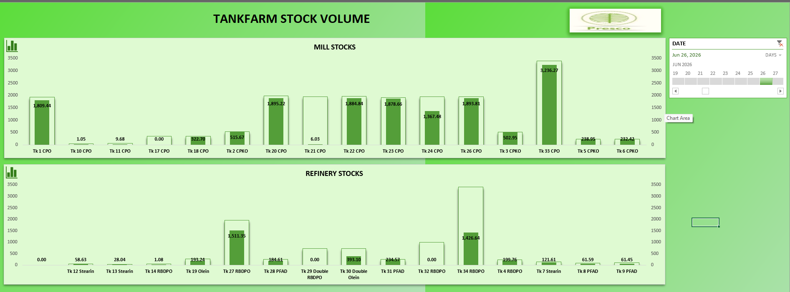

# Tankfarm Stock Volume Dashboard

**Company:** Presco Plc
**Category:** Inventory / Volumetric Analytics · Real-Time Monitoring
**Tools:** Microsoft Excel (live-connected), company production server
**Status:** Deployed — in active use for daily and management reporting

---

## Overview

A real-time dashboard tracking stock volume across every storage tank in Presco's tankfarm, split by Mill Stocks (CPO, CPKO) and Refinery Stocks (RBDPO, PFAD, Stearin, Olein, and blended Double RBDPO/Olein). Unlike the other three dashboards, the underlying stock data wasn't entirely undocumented before this — but it existed only as raw numbers, not visualized, broken out by individual tank, or viewed side by side across Mill and Refinery in one place. This dashboard turns that into a live, tank-by-tank picture used to avoid overflow or stockouts, plan dispatch and sales, and reconcile what the Mill and Refinery dashboards report as produced against what's actually sitting in storage.

## Dashboard Snapshot

Two charts, filterable by date: **Mill Stocks** (16 tanks holding CPO and CPKO) and **Refinery Stocks** (tanks holding RBDPO, PFAD, Stearin, Olein, and blended Double RBDPO/Olein).

On the sampled date (Jun 26, 2026):

- **Largest single tank:** Tk 33 (CPO) at 3,236.27 tons — nearly double the next-largest Mill tank
- **Mill Stocks total (16 tanks):** ≈ 15,795 tons of CPO/CPKO in storage
- **Refinery Stocks total:** ≈ 4,476 tons of RBDPO/PFAD/Stearin/Olein in storage
- **Combined tankfarm stock:** ≈ 20,270 tons across Mill and Refinery
- **Flagged for follow-up:** at least one Mill tank (Tk 17, CPO) and one Refinery tank are sitting at 0.00 — i.e., empty or idle. Under the old numbers-only view that's easy to miss; on this dashboard it's a visible gap someone can act on the same day

## The Business Problem

| Before | Impact |
|---|---|
| Tank stock data existed only as raw numbers, not visualized | No quick way to see which tanks were near capacity, near-empty, or how stock was distributed across Mill vs. Refinery |
| No single view combining Mill and Refinery storage | Cross-checking production output against what's actually in the tankfarm required manually pulling numbers from separate places |
| No easy way to spot idle/empty tanks at a glance | An empty or underused tank could go unnoticed instead of being flagged for action |
| No easy way to compare stock levels across time periods | Dispatch and sales planning relied on manually checking current levels rather than a live, filterable view |

## The Solution

Connected Excel directly to the production server as a live data source, then built a dashboard on top of it to:

- Visualize every tank's current stock volume, split clearly into Mill Stocks and Refinery Stocks
- Make near-empty or unusually high tanks visible at a glance instead of buried in a spreadsheet of raw numbers
- Give logistics/dispatch, management, and executives one live view to plan what can be shipped or sold, and to reconcile storage against what Mill and Refinery report as produced
- Filter by date so tank levels can be checked for any day, not just today

## Data & Tools

| Component | Detail |
|---|---|
| Data source | Production server (direct connection) |
| Scope | 16 Mill tanks (CPO, CPKO) and multiple Refinery tanks (RBDPO, PFAD, Stearin, Olein, Double RBDPO/Olein blends) |
| Refresh | Real-time / live |
| Build tool | Microsoft Excel (same workbook suite as the Mill dashboard) |
| Output | Two-panel tank-by-tank bar chart (Mill Stocks / Refinery Stocks) with date filtering |

## Results & Business Impact

| Metric | Result |
|---|---|
| Visibility | Tank-by-tank stock is now visualized rather than read off a raw number list — near-empty and highest-volume tanks are visible at a glance |
| Adoption | Used daily by plant/production management, executives, floor supervisors, and the logistics/dispatch team |
| Dispatch/sales planning | Logistics and dispatch can now see exactly how much of each product is available across every tank before committing to a shipment or sale |
| Overflow/stockout prevention | Tanks approaching capacity or sitting empty are now visible immediately rather than discovered later |
| Reconciliation | Storage levels can be checked directly against Mill and Refinery production figures from the other two dashboards |

## Skills Demonstrated

`Excel` · `Live server data connections` · `Inventory/volumetric analytics` · `Multi-facility (Mill + Refinery) reporting` · `Dashboard design` · `Executive & logistics reporting`

## Dashboard Screenshot

